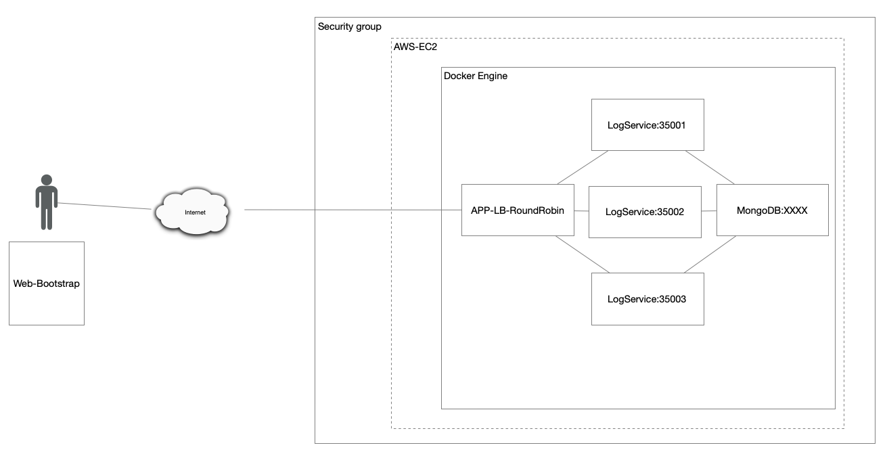
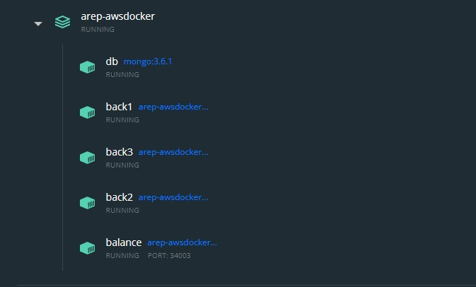
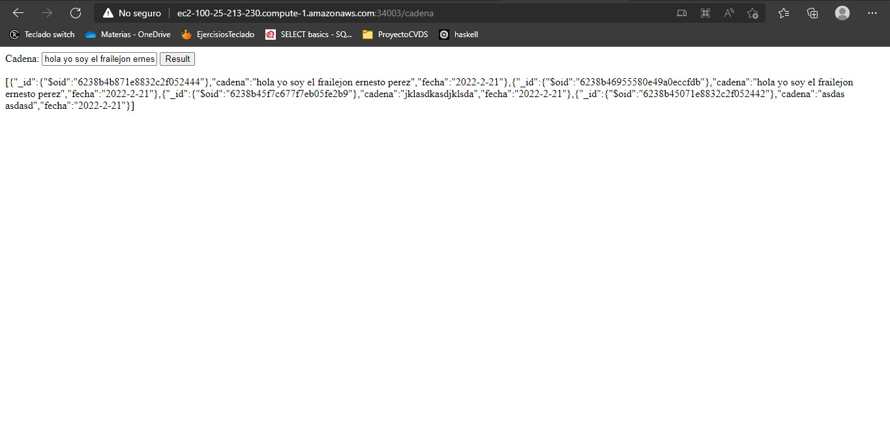
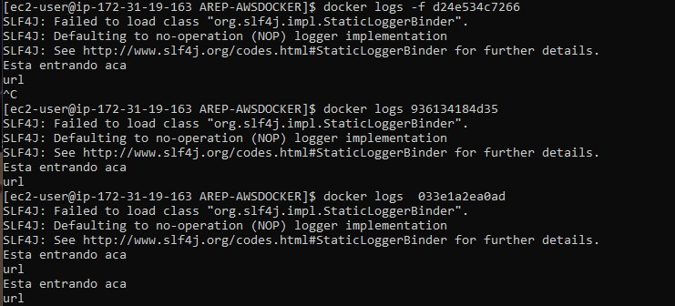
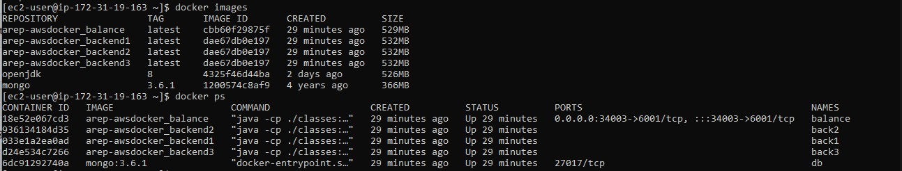

# DOCKER-AWS-MONGODB
Este proyecto está basado principalmente en una arquitectura de tipo **Cliente-servidor**, en este caso como servidor cuenta con tres, para poder distribuir la carga se usa **Round Robin** que es un balanceador de carga con el fin de que no se sature un servidor este lo que hace es repartir en tres la carga, para el tema del despliegue se usa **Docker** el cual es capaz de automatizar este proceso usando contenedores. En este caso este se almacena en un servidor **EC2** de **AWS**, para ser desplegado desde este.


## Conceptos Básicos


### Docker


"*Docker es un proyecto de código abierto que automatiza el despliegue de aplicaciones dentro de contenedores de software, proporcionando una capa adicional de abstracción y automatización de virtualización de aplicaciones en múltiples sistemas operativos.*"


### Spark


"*Spark es un framework de computación en clúster open-source. Fue desarrollada originariamente en la Universidad de California, en el AMPLab de Berkeley.*"


### MongoDB
"*MongoDB es un sistema de base de datos NoSQL, orientado a documentos y de código abierto. En lugar de guardar los datos en tablas, tal y como se hace en las bases de datos relacionales, MongoDB guarda estructuras de datos BSON (una especificación similar a JSON) con un esquema dinámico, haciendo que la integración de los datos en ciertas aplicaciones sea más fácil y rápida.*"


### Round Robin
"*Round-robin es un método para seleccionar todos los abstractos en un grupo de manera equitativa y en un orden racional, normalmente comenzando por el primer elemento de la lista hasta llegar al último y empezando de nuevo desde el primer elemento.*"


### AWS(EC2)
*"Amazon Elastic Compute Cloud es una parte central de la plataforma de cómputo en la nube de la empresa Amazon.com denominada Amazon Web Services. EC2 permite a los usuarios alquilar computadores virtuales en los cuales pueden ejecutar sus propias aplicaciones."*


## Arquitectura



Como podemos ver en la imagen se puede evidenciar fácilmente como se está estructurando, en este caso si no hubiera realizado el **APP-LB-RoundRobin** por medio de un **HttpServer** se podría ver de mejor manera la arquitectura **Cliente-servidor**, este para poder comunicarse con los **LogServices** utiliza peticiones **GET** el cual usa como Framework **Spark**, una vez que es enviada esta información hacia el back este se encarga de almacenarlo dentro de una base de datos no relacional, en este caso estamos usando **MongoDB**, después el back le solicita los datos que tenga para este encargarse de mandar los 10 últimos datos almacenados dentro de la base datos por medio de **JSON** para ser mostrados en el **Frontend**.


## Generar Imágenes


Para poder generar las imágenes de Docker, se hace una copia del repo, después debemos compilar el backend y el balanceador, para poder hacer esto ingresamos a estas carpetas y utilizamos los comandos.
```
mvn clean install
mvn package
```
### Nota
Debemos tener en cuenta que hay posibilidades de que toque modificar algo en el código debido a que este fue adaptado para que se desplegara en AWS, por tanto, talvez toque comentar y des comentar un par de líneas de código donde se ve algo de localhost dentro del balanceador.

Una vez ya compilado debemos estar en la carpeta principal donde ejecutaremos el commando.
```
docker-compose up -d
```
El cual se encargara de generar la imagenes y desplegar el proyecto.

## Links
### Local
```
localhost:34003/cadena
```
### AWS
Tener en cuenta que para poder probar este usted debe desplegar este dentro de un servidor en AWS ya que este que se encuentra es solo de demostracion, por tanto ya no estara en linea.
```
http://ec2-100-25-213-230.compute-1.amazonaws.com:34003/cadena
```

## Despliegue AWS 
Debido a que en el local usamos **docker-compose** lo que hace es como si generar un solo contenedor para todo y de esta forma no es necesario direccionar puertos para cada uno de ellos, solo para uno que es el del front que es único que si necesita ser mapeado, con los nombres que se le asigna no hace falta tampoco especificar una url solo se necesita el nombre. Lo que se hace usualmente es hacer un docker push a las imágenes, estas se suben de forma independiente, y al momento de descargarlas en AWS se estarían generando 5 contenedores, y en este caso toca especificar cada uno de los puertos para poder consultar, debido a que nosotros no lo configuramos desde un principio de esta forma la forma más fácil es subir directamente toda la carpeta del proyecto al servidor de AWS, de esta forma ya dentro que hace un docker-compose para que se genere igual que lo teníamos en forma local.



Como podemos ver en las imagenes anteriores se an insertado 4 cadenas, para comprobar que el Round Robin si validamos en la imagen se ve claramente que a entrado cuatro veces de forma reaprtida para hacer que sea menos estresante para los servidores.


Podemos comprobar las imagenes y los contenedores.


## Auhtor
Juan Sebastian Cadavid
